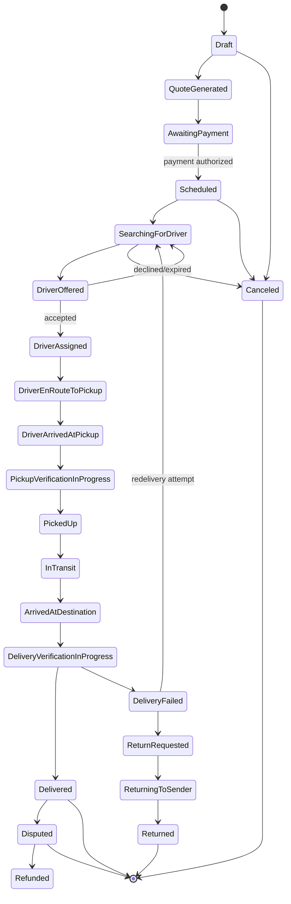

# Courier Marketplace — Product Specification (Phase 2)

**Working name:** [APP NAME] — replace throughout once finalized.
**Scope note:** Multi-market-native platform, **sequenced market activation** (see Delivery Plan for the recommended rollout order and rationale). Nationwide day-one *infrastructure*, not nationwide day-one *operations* — driver supply, insurance, and licensing realistically gate which markets are actually live at launch.

---

## 1. Product Requirements Document (PRD)

### 1.1 Problem
Individuals and businesses currently use rideshare apps informally for package delivery — no courier-specific pricing, no chain-of-custody, no proof of pickup/delivery, no multi-stop grouping, no business tooling. [APP NAME] replaces that informal behavior with a dedicated courier product.

### 1.2 Value proposition
- **Customers:** transparent courier pricing, real proof of pickup/delivery, multi-stop and business-volume support.
- **Drivers:** grouped-route earnings, clear payout math before accepting, protection via structured chain-of-custody (fewer disputes blamed on them).
- **Platform:** dispatcher oversight, configurable pricing/margin control, auditable operations.

### 1.3 MVP Scope
(Restating your Section 16, unchanged — this is the contract for Phase 6.)
- Customer registration/verification; driver onboarding + admin approval
- Immediate + scheduled delivery; single or multiple packages per order
- Multiple concurrent active orders per driver
- Automated matching + suggested geographic grouping, with dispatcher override
- Configurable zone/distance/package/service-level pricing
- Card payments (Stripe Connect); driver earnings ledger
- Live tracking; live pickup selfie; pickup/delivery photos; signature or PIN
- Push/SMS/email notifications
- Admin ops dashboard; claims + basic refunds; audit logs

### 1.4 Non-Goals (MVP)
- Passenger transportation of any kind
- Cash, weapons, hazardous materials, illegal goods, age-restricted items without a dedicated compliance program
- Facial recognition / biometric identity matching
- Fully dynamic (real-time surge) pricing — MVP uses rule-based + scheduled pricing only
- Automated competitor-price scraping — benchmark prices are manually/legally entered by an admin
- Enterprise invoicing/NET-30 terms
- Complex insurance/declared-value underwriting beyond a flat protection fee
- Bike/walking couriers, freight/pallet delivery

---

## 2. Personas

| Persona | Summary | Primary goal |
|---|---|---|
| **Casey, Individual Customer** | Occasional sender — a forgotten laptop charger, a same-day gift. | Fast quote, trust that the item arrives intact, real-time visibility. |
| **Priya, Small-Business Customer** | Boutique/e-commerce owner sending 5–30 packages/day. | Predictable pricing, batch order creation, reliable SLAs, simple reporting. |
| **Marcus, Driver** | Gig courier driving a sedan, wants predictable grouped-route income. | Fair, transparent payout before accepting; low-friction pickup/delivery flow. |
| **Dana, Dispatcher/Ops** | Monitors live map, resolves exceptions, overrides grouping. | Visibility into every order; ability to intervene fast. |
| **Owen, Ops/Finance Admin** | Configures pricing, zones, payouts; reviews claims. | Margin control, auditability, fast dispute resolution. |

---

## 3. User Journeys (key flows)

**J1 — Casey requests an immediate delivery**
Open app → enter pickup + drop-off → describe package (category, size, photo) → see 2–3 service-level quotes with itemized breakdown → select → pay → track driver live → receive delivered notification with POD photo → rate driver.

**J2 — Priya creates a recurring business batch**
Log in to business account → upload/select saved addresses → create 12 same-zone orders → system suggests grouping → review consolidated quote → approve → orders enter dispatch as a route-eligible batch.

**J3 — Marcus accepts a grouped route**
Go online → receive grouped offer showing total distance, stop count, payout, required vehicle → accept → app shows optimized stop sequence → arrive at each pickup, verify (selfie + photo + scan) → drive sequence → verify each delivery independently → cash out earnings.

**J4 — Dana handles a stuck delivery**
Sees a delayed order on live map → opens order → contacts driver via masked call → reassigns to another driver or approves return-to-sender → system recalculates route and notifies affected customers.

**J5 — Failed delivery + claim**
Driver reports recipient unreachable → selects failed-delivery reason + evidence → customer notified, offered redelivery/return/refund → if damaged-item claim filed, admin reviews photos/timestamps/GPS and issues resolution.

---

## 4. User Stories (representative sample — full backlog in Phase 5)

- As a customer, I can get an itemized quote before I commit to paying, so I know exactly what I'm charged for.
- As a customer, I cannot see another customer's info even when our packages share a driver route.
- As a driver, I can see estimated payout and required vehicle type before accepting an offer, so I don't accept unprofitable or infeasible work.
- As a driver, I cannot mark a package delivered without GPS proximity + proof-of-delivery evidence.
- As a dispatcher, I can override system-suggested grouping and see why the system grouped orders the way it did.
- As an admin, I can roll back a pricing-rule version if a change was published in error.
- As an admin, I can suspend a driver whose insurance document has expired, and the system prevents that driver from receiving new offers automatically.

---

## 5. Functional Requirements
Directly inherited from your Sections 2–10 (customer/driver/admin capabilities, chain-of-custody, grouping, pricing, lifecycle, dispatch, payments, notifications, safety). Treat those sections as the authoritative functional requirement list; this document does not restate every bullet — see `02-architecture.md` for how each is implemented.

## 6. Non-Functional Requirements

| Category | Requirement |
|---|---|
| Availability | 99.9% for customer/driver apps during business hours per active market |
| Latency | Quote generation < 2s p95; live location update propagation < 5s |
| Consistency | Order state transitions and payment capture must be strongly consistent (no dual-accept races) |
| Security | Encryption in transit (TLS1.2+) and at rest; least-privilege RBAC; signed/expiring URLs for all evidence media |
| Privacy | Customer PII never exposed to other customers; driver PII never exposed to customers (masked comms) |
| Auditability | Every state transition, pricing change, and payout adjustment is immutably logged with actor, timestamp, reason |
| Offline tolerance | Driver app queues valid pickup/delivery events offline and syncs without creating duplicate completions |
| Scalability | Architecture must scale from 1,000 → 100,000 deliveries/month without a rearchitecture (see cost/scale doc) |

## 7. Business Rules (selected, high-impact)
- A delivery cannot be marked "Delivered" before it is marked "Picked up."
- A driver cannot exceed vehicle-type capacity (weight/volume/count) across all active packages.
- A pricing quote expires (default 15 minutes) and cannot be honored after expiration — must be re-quoted.
- Every accepted order stores the exact pricing-rule version used; later rule changes never retroactively affect it.
- Two drivers can never both successfully accept the same offer (atomic accept, first-write-wins).
- A grouped batch is billed and paid out per-package, not per-route — grouping affects efficiency/savings distribution, not per-package pricing logic.

## 8. Order State Machine

### Transition authority table (excerpt)

| From → To | Who can initiate | Required evidence | Payment effect |
|---|---|---|---|
| Draft → QuoteGenerated | System (server) | Valid pricing calc | none |
| AwaitingPayment → Scheduled | System | Payment authorization success | Card authorized (not captured) |
| DriverOffered → DriverAssigned | Driver (accept) or Admin (manual assign) | Atomic lock acquired | none |
| PickupVerificationInProgress → PickedUp | Driver (via app), validated by server | GPS radius pass, live selfie, package photo(s), sender name | Capture milestone 1 (config) |
| DeliveryVerificationInProgress → Delivered | Driver, validated by server | GPS radius pass, POD photo (unless contactless-exempt), recipient name + sig/PIN/QR | Capture milestone 2 / final capture |
| DeliveryVerificationInProgress → DeliveryFailed | Driver | Reason code + evidence | Failed-delivery fee per policy |
| Delivered → Disputed | Customer or Admin | Claim submission | Funds held pending resolution |
| * → Canceled | Customer (pre-pickup, per cancellation window) or Admin | none | Cancellation fee per policy |

All transitions are server-authoritative; clients submit *evidence*, never the resulting state.

## 9. Permissions Matrix (excerpt — full RBAC table in Architecture doc §Security)

| Action | Customer | Driver | Dispatcher | Ops Manager | Finance | Super Admin |
|---|:---:|:---:|:---:|:---:|:---:|:---:|
| Create order | ✅ (own) | – | ✅ (on behalf) | ✅ | – | ✅ |
| Accept/decline offer | – | ✅ (own) | – | – | – | ✅ |
| Override route grouping | – | – | ✅ | ✅ | – | ✅ |
| Issue refund | – | – | ✅ (limited $) | ✅ | ✅ | ✅ |
| Publish pricing rule | – | – | – | ✅ (draft) | – | ✅ (publish) |
| Suspend driver | – | – | ✅ (flag) | ✅ | – | ✅ |
| View another customer's PII | – | – | ✅ (support ctx) | ✅ | ✅ | ✅ |
| Export audit log | – | – | – | ✅ | ✅ | ✅ |

## 10. Exception & Failure Scenarios (selected)
- **Driver goes offline mid-route with active packages** → dispatcher alerted, undelivered packages re-enter offer pool, affected customers notified of delay, custody chain logged as "reassignment pending."
- **Payment authorization succeeds but capture fails at delivery** → order still marked delivered (service was rendered); payment enters retry/dunning queue; ops alerted after N failed retries.
- **Two grouped packages, one delivery fails** → only the failed package re-enters return/redelivery flow; the rest of the route is unaffected.
- **GPS spoofing suspected (impossible speed/jump)** → pickup/delivery verification blocked, flagged for manual review, driver notified with reason.
- **Recipient refuses signature but accepts package (contactless not selected)** → driver selects "recipient present, signature declined," photo + GPS + timestamp still required, order still completes with a flag on the record.

## 11. Acceptance Criteria (MVP-level, measurable — expanded per-story in Phase 5)
- 95% of quotes generated in under 2 seconds from valid input.
- 0 instances (in load/concurrency testing) of duplicate offer acceptance.
- 100% of pickups/deliveries have an immutable, queryable custody event log entry.
- Grouped batches never mix packages from different customers into a single visible manifest for either customer.
- Every accepted order retrievable with the exact pricing-rule version and full breakdown used to charge it.
