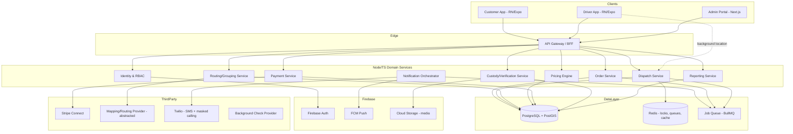

# Courier Marketplace — Architecture Specification (Phase 3)

## 1. Backend decision: hybrid, with clear boundaries

**Decision:** Firebase for identity/notifications/media; Node.js/TypeScript services on PostgreSQL + PostGIS for everything transactional or geospatial.

| Capability | Owner | Why |
|---|---|---|
| Auth (customer, driver, admin login, sessions) | Firebase Authentication | Fast, secure, handles MFA/social login/email-verify out of the box |
| Push notifications | Firebase Cloud Messaging | Native cross-platform push, no separate infra |
| Media storage (selfies, package photos, POD, signatures) | Firebase Cloud Storage | Built-in signed URLs, CDN, easy mobile SDK upload |
| Orders, packages, stops, routes, offers, quotes, pricing, payments, payouts, custody events | Node/TS services + PostgreSQL/PostGIS | Needs multi-row transactions (atomic offer-accept), true geospatial queries (radius, zone containment, route overlap), and relational integrity across ~30 entities that FMVP's document model handles poorly |
| Background jobs (dispatch timeouts, payout runs, notification fan-out) | Cloud Tasks / a Redis-backed queue (BullMQ) | Reliable retries, idempotency |

**The seam:** every Postgres `users` row stores the Firebase `uid` as its external identity key. A lightweight `auth-sync` Cloud Function keeps display-name/verification-status changes in sync. All authorization decisions are made server-side against the Postgres role/permission tables — Firebase Auth is identity only, never authorization.

**Tradeoff being accepted:** two operational systems instead of one. Mitigated by: (a) Firebase footprint is deliberately narrow (auth/push/media only — no Firestore as source of truth), (b) all business logic lives in one place (Node services), so there's no split-brain over *where* a rule lives, only over *where the row lives*.

---

## 2. System Architecture Diagram

---

## 3. Mobile & Web Architecture

**Mobile (Customer + Driver apps):** React Native + Expo + TypeScript, shared monorepo package for design tokens, API client, and cross-cutting types (order/package/pricing shapes). Secure token storage via `expo-secure-store`. Driver app: foreground service for background location, gated strictly to "active delivery in progress" state, permission explicitly requested with plain-language disclosure, and torn down immediately on delivery completion or going offline. Camera module handles live-selfie capture (camera-only, gallery picker disabled for that specific flow), package photos, and barcode/QR scanning (via `expo-camera` + a barcode scanning library).

**Admin Portal:** Next.js + TypeScript, server components for data-heavy dashboards, map view (Mapbox GL or Google Maps JS) for live driver/order positions, role-gated navigation driven by the same RBAC table the backend enforces (never trust client-side role checks alone).

**Offline handling (driver app):** pickup/delivery verification events are written to a local queue (SQLite via `expo-sqlite`) first, then synced. Each queued event carries a client-generated idempotency key; the server rejects a second event with the same key, preventing duplicate "Delivered" transitions if the app retries after a dropped connection.

---

## 4. Backend Domain Boundaries

Each domain is a separate Node/TS service (can start as separate modules in one deployable and be split later — do not premature-microservice at MVP scale):

- **Identity & RBAC** — users, roles, permissions, sessions (validates Firebase tokens, issues internal session context)
- **Order Service** — order/package/stop lifecycle, state machine enforcement
- **Pricing Engine** — quote calculation, pricing-rule versions, benchmark comparison
- **Dispatch Service** — matching, offers, atomic accept, escalation
- **Routing/Grouping Service** — geospatial candidate grouping, route optimization (delegates to Maps provider via an abstraction interface)
- **Custody/Verification Service** — pickup/delivery verification, GPS radius checks, evidence storage orchestration
- **Payment Service** — Stripe Connect integration, capture milestones, refunds, driver payouts, webhook handling
- **Notification Orchestrator** — event-driven fan-out to push/SMS/email, in-app masked messaging
- **Reporting Service** — read-optimized aggregation for admin dashboards/KPIs

Interfaces between domains are internal REST/RPC calls behind the API Gateway; cross-domain side effects (e.g., "order picked up → notify customer") go through the job queue as events, not direct synchronous calls, so one domain's slowness doesn't cascade.

---

## 5. Core Data Model

Notation: 🔒 = contains sensitive PII/PCI-adjacent data requiring restricted access + retention policy.

### 5.1 Identity & Accounts

| Entity | Key fields | Notes |
|---|---|---|
| **users** 🔒 | id (uuid, PK), firebase_uid (unique), email, phone, email_verified_at, phone_verified_at, role_type (customer/driver/admin), status, created_at | Indexes: firebase_uid, email, phone |
| **customer_profiles** | user_id (FK), display_name, account_type (personal/business), default_payment_method_id | 1:1 with users where role=customer |
| **business_accounts** 🔒 | id, owner_user_id (FK), legal_name, tax_id, billing_address_id, volume_tier | tax_id restricted field |
| **recipients** 🔒 | id, order_id (FK), name, phone, delivery_address_id | Not a full user account; scoped to one order |
| **drivers** 🔒 | id, user_id (FK), status (pending/approved/suspended/deactivated), rating_avg, active_order_count, current_zone_id | Index: status, current_zone_id (geospatial) |
| **driver_verification_records** 🔒 | id, driver_id (FK), check_type (id/license/background), status, verified_at, expires_at, provider_ref | Index: expires_at (for expiration sweeps) |
| **driver_documents** 🔒 | id, driver_id (FK), doc_type, file_ref (Storage path), expires_at, status | Signed-URL access only |
| **vehicles** | id, driver_id (FK), type (sedan/van), plate, capacity_weight_kg, capacity_volume_l, insurance_doc_id | |
| **driver_availability** | id, driver_id (FK), online_status, current_location (geography), last_ping_at | High-write table; consider TTL/partitioning |
| **addresses** 🔒 | id, owner_id, line1, line2, city, state, postal, geo (geography POINT), label | Index: geo (GiST) |

### 5.2 Service Areas & Zones

| Entity | Key fields |
|---|---|
| **service_areas** | id, name, market_status (active/planned/paused), timezone |
| **zones** | id, service_area_id (FK), geometry (PostGIS polygon), h3_cells[], operating_hours, blackout_periods |

### 5.3 Orders & Delivery

| Entity | Key fields | Notes |
|---|---|---|
| **orders** | id, customer_id (FK), business_account_id (nullable), status (state machine enum), service_level, created_at, quote_id (FK), pricing_rule_version_id (FK) | Index: status, customer_id, created_at |
| **packages** | id, order_id (FK), category, weight, dimensions, declared_value_cents, quantity, fragile, perishable, confidential, photo_refs[] | |
| **stops** | id, order_id (FK), type (pickup/dropoff), address_id (FK), sequence_no, time_window_start, time_window_end | |
| **route_batches** | id, driver_id (FK), status, created_by (system/dispatcher), grouping_reason (json) | grouping_reason stores the "why grouped" explanation |
| **route_assignments** | id, route_batch_id (FK), stop_id (FK), sequence_no, eta | |
| **driver_offers** | id, route_batch_id or order_id, driver_id (FK), status (pending/accepted/declined/expired), payout_cents, expires_at | Unique partial index enforcing one "accepted" per order |
| **location_events** | id, driver_id (FK), order_id (nullable), geo (geography), recorded_at | Partitioned by day; short retention (see §7) |

### 5.4 Chain of Custody

| Entity | Key fields | Notes |
|---|---|---|
| **chain_of_custody_events** | id, package_id (FK), event_type (pickup_verified/delivery_verified/failed/returned), actor_driver_id, occurred_at, geo, device_id | Immutable — insert-only table, no updates/deletes |
| **pickup_verification** 🔒 | id, order_id (FK), driver_selfie_ref, package_photo_refs[], sender_name, sender_signature_ref (nullable), pin_used (bool), gps_radius_pass (bool) | |
| **delivery_verification** 🔒 | id, order_id (FK), pod_photo_ref, recipient_name, recipient_signature_ref (nullable), pin_used, id_verified (bool), gps_radius_pass (bool), outcome | |
| **media_evidence** 🔒 | id, ref_type, ref_id, storage_path, content_hash, captured_at, retention_expires_at | content_hash supports tamper-evidence |
| **signatures** 🔒 | id, ref_type, ref_id, storage_path, captured_at | |

### 5.5 Pricing

| Entity | Key fields |
|---|---|
| **quotes** | id, order_draft_id, breakdown (json), total_cents, expires_at, pricing_rule_version_id (FK) |
| **pricing_plans** | id, name, scope (city/zone/customer_type/vehicle_type), active |
| **pricing_rules** | id, pricing_plan_id (FK), rule_type, params (json), priority |
| **pricing_rule_versions** | id, pricing_plan_id (FK), version_no, published_at, published_by, snapshot (json) | Immutable snapshot referenced by every order |
| **promotions** | id, code, discount_type, value, constraints (json), usage_limit, expires_at |

### 5.6 Payments & Earnings

| Entity | Key fields | Notes |
|---|---|---|
| **payments** 🔒 | id, order_id (FK), stripe_payment_intent_id, amount_cents, status, captured_at | Never stores raw card data |
| **refunds** | id, payment_id (FK), amount_cents, reason, issued_by | |
| **driver_earnings** | id, driver_id (FK), order_id (FK), amount_cents, type (base/tip/incentive/adjustment), status | |
| **payouts** | id, driver_id (FK), amount_cents, stripe_transfer_id, period_start, period_end, status | |

### 5.7 Trust, Support, Admin

| Entity | Key fields |
|---|---|
| **ratings** | id, order_id (FK), rater_type, rating_value, comment |
| **claims_disputes** | id, order_id (FK), type, status, evidence_refs[], resolution, resolved_by |
| **notifications** | id, user_id (FK), channel, event_type, payload, sent_at, status |
| **support_conversations** | id, order_id (nullable), participants[], channel, log_ref |
| **admin_users** | id, user_id (FK), department |
| **roles / permissions / role_permissions** | standard RBAC join tables |
| **audit_logs** | id, actor_id, action, entity_type, entity_id, before (json), after (json), occurred_at | Insert-only, indexed on entity_type+entity_id |
| **system_configuration** | key, value (json), updated_by, updated_at |

**Retention policy summary:** raw location pings retained 30 days then aggregated/deleted; custody media retained per legal-review outcome (default 2 years, configurable per market); audit logs retained indefinitely; PII deletion requests handled via a dedicated privacy-request workflow that soft-deletes/anonymizes while preserving financial/audit records required by law.

---

## 6. API Specification (representative endpoints by domain)

Full endpoint-by-endpoint schema docs belong in an OpenAPI spec generated alongside implementation; below is the authoritative shape/pattern for each domain so that spec can be generated consistently.

| Domain | Method & Path | Role | Idempotency | Notes |
|---|---|---|---|---|
| Auth | `POST /v1/auth/verify-phone` | Customer/Driver | key required | Sends + confirms OTP |
| Profiles | `PATCH /v1/customers/me` | Customer | n/a | Self-service profile edit |
| Driver onboarding | `POST /v1/drivers/apply` | Driver | key required | Creates driver + verification records in `pending` |
| Driver onboarding | `POST /v1/drivers/{id}/documents` | Driver | key required | Signed upload URL flow |
| Verification | `POST /v1/admin/drivers/{id}/approve` | Ops/Super Admin | n/a | Audit-logged, triggers notification |
| Quotes | `POST /v1/quotes` | Customer | key required | Server-authoritative pricing calc, returns breakdown + expiry |
| Orders | `POST /v1/orders` | Customer | key required | Consumes a valid, unexpired quote |
| Orders | `POST /v1/orders/{id}/cancel` | Customer/Admin | key required | Enforces cancellation-window rules |
| Dispatch | `POST /v1/internal/dispatch/offer` | System (internal) | key required | Creates timed offer, schedules expiry job |
| Dispatch | `POST /v1/driver-offers/{id}/accept` | Driver | atomic (DB constraint) | First-write-wins; others auto-decline |
| Grouping | `POST /v1/internal/routing/group` | System (internal) | n/a | Candidate generation, dispatcher-reviewable |
| Grouping | `POST /v1/admin/route-batches/{id}/override` | Dispatcher | n/a | Manual regroup, audit-logged |
| Pickup | `POST /v1/orders/{id}/pickup/verify` | Driver | key required | GPS check, selfie+photo refs, marks `PickedUp` only on full pass |
| Delivery | `POST /v1/orders/{id}/delivery/verify` | Driver | key required | GPS check, POD/signature/PIN, marks `Delivered`/`DeliveryFailed` |
| Location | `POST /v1/drivers/me/location` | Driver | n/a, rate-limited | Only accepted while driver has an active order |
| Payments | `POST /v1/internal/payments/capture` | System (internal) | key required | Triggered on milestone transitions |
| Payments | `POST /v1/webhooks/stripe` | Stripe (signed) | signature-verified, key required | Idempotent event processing |
| Payouts | `GET /v1/drivers/me/earnings` | Driver | n/a | |
| Ratings | `POST /v1/orders/{id}/rating` | Customer/Driver | key required | One rating per order per role |
| Claims | `POST /v1/orders/{id}/claims` | Customer | key required | |
| Admin/Reporting | `GET /v1/admin/reports/kpis` | Ops/Finance | n/a | Cursor-paginated aggregates |
| Audit | `GET /v1/admin/audit-logs` | Ops/Super Admin | n/a | Filterable, exportable |

**Cross-cutting rules for every endpoint:** bearer token validated against Firebase, then mapped to internal role via RBAC; every mutating endpoint requires an `Idempotency-Key` header where noted; every state-changing action writes an `audit_logs` row; standard error shape `{ error_code, message, request_id }`; per-role rate limits enforced at the gateway (tighter for `POST /location` and offer-accept endpoints).

---

## 7. Event & Job Architecture

- **Queue:** Redis-backed (BullMQ) for MVP scale; revisit at 100k+ deliveries/month.
- **Key jobs:** offer-expiry sweep, driver-document-expiration sweep (daily), payout batch run (scheduled), notification fan-out (event-triggered), location-ping aggregation/pruning (daily), pricing-rule-version publish (transactional, versions are immutable once published).
- **Idempotency:** every job/webhook consumer checks a `processed_events` table keyed by event id before acting.

## 8. Dispatch Algorithm (design)

1. New order (or route-eligible batch) enters `SearchingForDriver`.
2. Candidate driver query: online drivers within radius, sufficient remaining capacity, required vehicle type, zone match, no recent decline/timeout for this order, rating threshold.
3. Score candidates on: distance/ETA, opportunity to fold into an existing active route (grouping bonus), driver reliability score, expected payout vs. platform margin floor.
4. Send **timed offer** (default 45–60s) to top-ranked driver (or top-N simultaneously in low-density zones, first-accept-wins via atomic DB constraint).
5. On decline/timeout: log, penalize that driver's candidacy briefly for this order, re-offer to next candidate; escalate to dispatcher after N failed rounds or beyond an SLA time threshold.
6. On accept: atomically create `route_assignment`, lock the order, notify customer.

## 9. Route-Grouping Algorithm (design)

1. Candidate generation: index active un-batched orders by H3 cell for both pickup and dropoff.
2. Filter pairs/sets by: time-window compatibility, package-category compatibility, no exclusivity flag, combined weight/volume within a plausible vehicle's capacity.
3. Score candidate groupings by route-overlap (using the mapping provider's distance matrix) vs. detour cost added to each individual order's promised window.
4. Reject groupings whose added detour exceeds the admin-configured threshold or whose profitability (revenue − est. driver payout − est. cost) falls below floor.
5. Persist top-scoring groupings as `route_batches` in a dispatcher-reviewable "suggested" state; auto-approve only below a configurable risk/complexity threshold, else require dispatcher approval.
6. Store `grouping_reason` (which factors matched) for transparency in the dispatcher UI.
7. Recompute affected batches on cancellation/delay/reassignment (triggered as an async job, not inline, to avoid blocking the triggering request).

## 10. Pricing Engine (design)

- Rule-based, versioned, evaluated server-side only.
- A `pricing_plan` selects applicable `pricing_rules` by scope match (zone, customer type, vehicle type, service level, time period).
- Each rule contributes a named line item to the breakdown (base fee, distance charge, size charge, surcharges, discounts, etc.) — see your Section 5 list; each maps 1:1 to a rule type.
- Final calculation snapshots the exact rule set + values into a `pricing_rule_versions` row referenced by the resulting quote/order — later rule edits never retroactively change historical orders.
- Benchmark comparison: admin manually enters/imports an authorized competitor price for a lane; engine reports our price as below/at/above benchmark *after* enforcing minimum driver payout and platform margin floors — those floors always win over benchmark-matching.
- Rules support a "test mode" — a rule can be evaluated against historical order data before publishing, output diffed against current live rules.

## 11. Security Model

- **AuthN:** Firebase Authentication (email/password, phone OTP, optionally social) issues ID tokens; backend validates on every request.
- **AuthZ:** RBAC enforced server-side via `roles`/`permissions` tables; every endpoint declares required permission(s); admin portal nav is driven by the same table (UI hiding is convenience, not security).
- **Object-level authorization:** every resource fetch checks ownership/role scope (a customer can only fetch their own orders; a driver only their own offers/routes) — enforced in service layer, tested explicitly (see Testing plan).
- **Media security:** all evidence photos/signatures stored in Cloud Storage with short-lived signed URLs; no public buckets; access logged.
- **Secrets:** managed via the cloud provider's secret manager (e.g., GCP Secret Manager); never in source or client bundles.
- **Webhooks:** Stripe signature verification required on every event; replay protection via idempotency table.
- **Rate limiting:** per-user and per-IP limits at the gateway, stricter on auth, offer-accept, and location endpoints.
- **PII isolation in grouped routes:** driver app shows only the current stop's contact info, masked via a communication-relay service (Twilio proxy numbers) — never the raw customer/recipient phone number.

## 12. Deployment Architecture

- Environments: dev → staging → production, fully isolated projects/databases.
- Node services containerized, deployed via CI/CD (GitHub Actions → Cloud Run or GKE depending on final scale needs — Cloud Run recommended for MVP simplicity).
- Postgres: managed (Cloud SQL/RDS) with PostGIS extension, read replica introduced once reporting load justifies it.
- Infrastructure as code (Terraform) for reproducibility across markets/environments.
- Feature flags for market activation (turn a `service_area` live without a deploy).

## 13. Observability Plan

- Structured JSON logs (request id, actor id, domain) shipped to a log aggregator.
- Metrics: dispatch offer accept-rate, quote latency, pickup/delivery verification pass-rate, payment failure rate — dashboarded (e.g., Grafana/Datadog).
- Distributed tracing across gateway → domain services → external providers (Stripe/Maps/Twilio) to isolate latency sources.
- Error monitoring (e.g., Sentry) wired into both mobile apps and backend services.
- Alerting on: offer-accept-rate drop, payment webhook failure spike, driver-document-expiration backlog, dispatch queue depth.

## 14. Estimated Infrastructure Costs (rough order-of-magnitude, USD/month)

These are directional planning numbers, not vendor quotes — confirm against current provider pricing before budgeting.

| Deliveries/mo | Compute (Cloud Run/GKE) | Postgres (managed + PostGIS) | Redis | Storage + CDN (media) | Firebase (Auth/FCM) | Maps/Routing API | SMS (Twilio) | **Est. total** |
|---|---|---|---|---|---|---|---|---|
| 1,000 | $50–150 | $60–120 (small instance) | $15–30 | $20–40 | ~$0–25 (free tier likely covers it) | $50–150 | $30–80 | **~$250–600** |
| 10,000 | $300–700 | $200–500 (add read replica) | $50–100 | $150–350 | $50–150 | $400–900 | $250–600 | **~$1,400–3,300** |
| 100,000 | $2,000–5,000 (autoscaled, multi-region) | $1,200–3,000 (HA + replicas) | $200–500 | $1,200–3,000 | $300–800 | $3,000–7,000 | $2,000–5,000 | **~$10,000–24,000** |

Biggest cost levers at scale: mapping/routing API calls (cache aggressively, batch distance-matrix calls) and SMS volume (prefer push/in-app over SMS where possible). Payment processing fees (Stripe ~2.9%+30¢ + Connect fees) are excluded above since they scale with GMV, not infra — model separately as a % of revenue.
